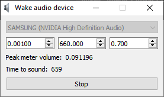

# WakeAudioDevice 1.1.1

Small utility that prevents audio devices turning off after some time from last sound was played.  
Utility plays sound file (sound.wav in the workdir by default) on timer, starting after peak meter detected sound volume that exceeded threshold value.
Also sound is playing after system was resumed from low-power state.  

Media Foundation library from Windows SDK is used to read and decode audio files (path to audio file can be set by 'PlaySoundFileName' option in settings.ini), so app should support audio formats listed here: https://docs.microsoft.com/en-us/windows/win32/medfound/supported-media-formats-in-media-foundation  
WASAPI is used for audio playback and EndpointVolume API to monitor and control volume level.

'Play sound volume' setting sets absolute audio device volume and ignores your device master volume level (that you see in Sndvol.exe and when clicking on audio icon in tray). It means for example, even if you set device volume manually to 10% and volume in app is set to 1.0, sound will be played at 100% of endpoint device volume level anyway.

Command line arguments: /hide for minimize to tray, /start for immediatly start on program launch.

Requirements: Windows Vista+ (not tested)

Built with Qt 5.15.2

